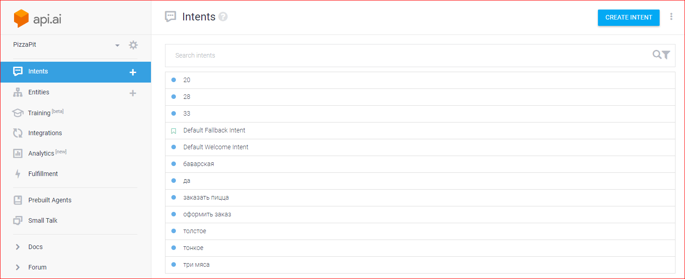
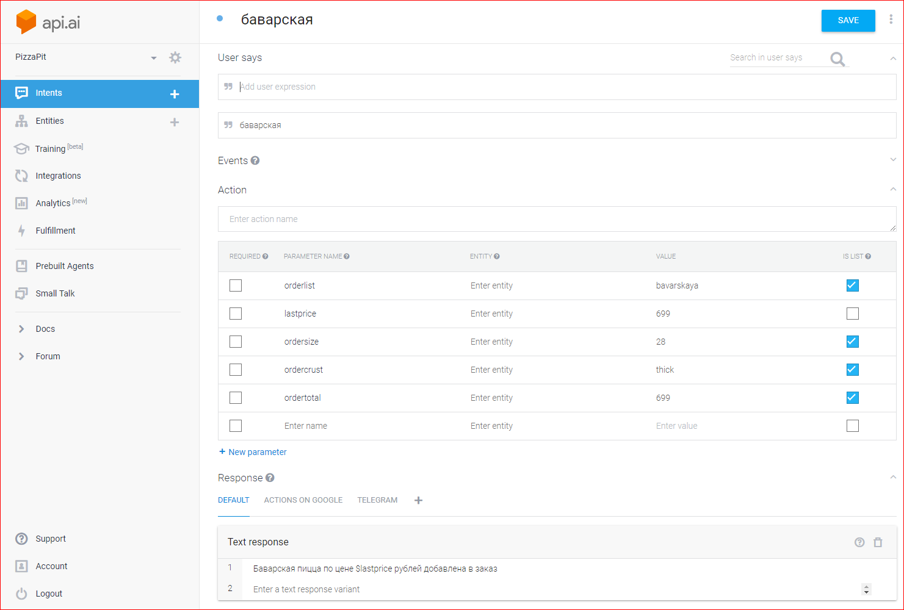

# PizzaPit

This project illustrates using [API.AI](https://api.ai/) for enabling rich conversation.

Also using TTS service such as Amazon Polly responses can be transformed into speech.

This example implements simplified Pizza order service from hello to delivery.

## Running

  * See TestConversation.java and TestPolly.java unit test cases
  
In future we will bring web interface.

## Example conversation (with context)

```bash
INFO: Requesting Привет!
INFO: Got response: Добрый день! Я могу автоматом заказать вам пиццу!, {total="0"}
INFO: Requesting Заказать пиццу
INFO: Got response: Какую пиццу вы хотите заказать? Например есть баварская., {}
INFO: Requesting Баварская пицца
INFO: Got response: Баварская пицца по цене 699 рублей добавлена в заказ, {ordercrust=["thick"], ordersize=["28"], lastprice="699", ordertotal=["699"], orderlist=["bavarskaya"]}
INFO: Requesting 33 см
INFO: Replaced ordertotal last value "699" with 779
INFO: Replaced ordersize last value "28" with 33
INFO: Got response: Размер последней пиццы установлен в 33 см, {}
INFO: Requesting тонкое тесто
INFO: Replaced ordercrust last value "thick" with thin
INFO: Got response: Тесто установлено на тонкое, {}
INFO: Requesting пицца 3 мяса
INFO: Got response: Пицца 3 мяса по цене 699 рублей добавлена в заказ, {ordercrust=["thick"], ordersize=["28"], lastprice="699", ordertotal=["699"], orderlist=["3meat"]}
INFO: Requesting оформить
INFO: Calculated sum: 1478 for ordertotal
INFO: Got response: Заказ на сумму 1478 рублей готов. Отправить в доставку?, {orderstatus="ready"}
INFO: Requesting да
INFO: Got response: Заказ передан в доставку! Спасибо!, {orderstatus="confirm"}
INFO: Final context {total="0", ordercrust=["thin","thick"], orderstatus="confirm", ordersize=["33","28"], lastprice="699", ordertotal=["779","699"], orderlist=["bavarskaya","3meat"]}
```

## Example api.ui project (dump available in repository)




